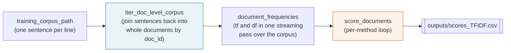

# Scoring

Once the dictionary is built, every document is scored as a weighted count of its dictionary hits, one score per dimension. `Pipeline.score` returns a DataFrame with one row per document, one column per dimension, plus a `document_length` column.

---

## The five methods

Let `tf` be the in-document frequency of a dictionary word, `df` its document frequency across the corpus, `N` the number of documents, and `rank` the word's rank in its dimension's expanded list (seeds at rank 0). Each hit contributes the following weight:

| Method | Per-hit weight |
|---|---|
| `TF` | $tf$ |
| `TFIDF` | $tf \cdot \log(N / df)$ |
| `WFIDF` | $(1 + \log tf) \cdot \log(N / df)$ |
| `TFIDF+SIMWEIGHT` | $tf \cdot \log(N / df) \cdot \dfrac{1}{\ln(2 + \text{rank})}$ |
| `WFIDF+SIMWEIGHT` | $(1 + \log tf) \cdot \log(N / df) \cdot \dfrac{1}{\ln(2 + \text{rank})}$ |

`TF` is the naive count baseline. `TFIDF` downweights words that appear in most documents, so a term like `quality` that shows up everywhere contributes less than a rare synonym. `WFIDF` further dampens within-document frequency, matching the 2021 paper's Appendix. The `+SIMWEIGHT` variants multiply in a similarity weight derived from dictionary rank: seeds (rank 0) get weight $1/\ln 2 \approx 1.44$, rank 100 gets $1/\ln 102 \approx 0.22$. `Config.tfidf_normalize=True` L2-normalizes the tfidf vector per document. `Config.zca_whiten=True` applies ZCA whitening to decorrelate the dimension columns after scoring; see [Whiten the dimension scores](../how-to/whiten-scores.md).

Per dimension, the raw score is the sum of per-hit weights over all dictionary matches. `document_length` is the count of non-stopword tokens in the cleaned document.

---

## Pipeline internals



The corpus is streamed rather than pickled, which was a change from the 2021 replication repo's `corpus_doc_level.pickle` materialization. On a 1,400-document corpus this saves a few hundred MB of disk and a minute of IO.

---

## Document-level aggregation

Most downstream use cases group multiple documents per entity per period. `Pipeline.firm_year` handles this:

```python
firm_year = p.firm_year(id_to_firm_df, method="TFIDF")
```

The aggregation does three things in order:

1. **Divide by document length.** Each dimension score becomes a per-token intensity, so a 200-token document and a 2,000-token document are comparable.
2. **Scale to per-100-tokens.** Multiply by 100 so the numbers sit in a readable range.
3. **Group and average.** Left-join the per-document scores with `id_to_firm_df` on `document_id`, group by `(firm_id, time)`, and take the mean of each dimension column. `time` can be year, quarter, or any granularity the caller provides.

The returned DataFrame has one row per group, one column per dimension, suitable for a regression or a time-series plot. The scorer is a weighted bag of words, so the familiar bag-of-words limits apply: no context, no negation handling, no aspiration-versus-practice distinction.
