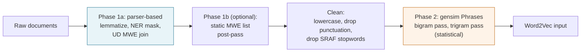

# Two-phase preprocessing

`lmsy_w2v_rfs` can construct multi-word expressions (MWEs) in two phases before Word2Vec sees a single token. Each phase catches a different class of MWE. Phase 2 (statistical) always runs; Phase 1a (parser-based) runs only when you select a parser backend — the default `preprocessor="none"` skips it.

---

## The flow

---

## Phase 1a: parser-based, syntactic

The configured parser tokenizes, lemmatizes, tags named entities, and joins tokens linked by Universal Dependencies v2 labels `fixed`, `flat`, `compound`, and `compound:prt`. Five backends are available through `Config.preprocessor`:

| value | Needs | Strength |
|---|---|---|
| `"none"` (default) | nothing | Whitespace tokenize + lowercase; zero dependencies, runs out of the box |
| `"static"` | `nltk` only | Deterministic curated-list pass; no parser |
| `"spacy"` | `[spacy]` extra and a model | Fastest parser; best NER; 0% `fixed` or `compound:prt` recall |
| `"corenlp"` | `[corenlp]` extra and Java 8+ | Paper-exact; 76% syntactic MWE recall; best JVM thread scaling |
| `"stanza"` | `[stanza]` extra | Python-native; 57% syntactic MWE recall; slowest on CPU |

The default, `"none"`, does no parsing — it just splits on whitespace and lowercases. It is the zero-friction starting point and is the right choice when your input is already tokenized, or when you simply want to try the package; Phase 2 and Word2Vec still produce useful dictionaries. The parser backends add value when you want their Phase 1a signals: lemmatization (so the seed `integrity` matches `integrities`/`integrated`) and NER masking (so firm names like `Apple` are replaced with `[NER:TYPE]` placeholders and cannot enter a dictionary). For paper-faithful Phase 1a, choose `"corenlp"`; for a fast Java-free parser, choose `"spacy"`.

## Phase 1b: optional static MWE list

After the main preprocessor runs, a curated MWE list (`Config.mwe_list`) can join anything the parser missed. The packaged `"finance"` list is a hand-curated ~246-entry file of UD `fixed` prepositional phrases and earnings-call jargon. Pass `mwe_list="finance"` to opt in.

## Phase 2: statistical, gensim Phrases

After cleaning, gensim's `Phrases` runs one bigram pass and (by default) one trigram pass on the corpus itself. It learns high-frequency co-occurrences that no parser will flag, because they are collocations rather than grammatical units.

---

## What each phase catches

The two phases are complementary because they rely on different signals:

| MWE | Caught by | Why |
|---|---|---|
| `customer_commitment` | Phase 1a | UD `compound` between two nouns |
| `with_respect_to` | Phase 1a | UD `fixed` prepositional phrase |
| `roll_out` | Phase 1a | UD `compound:prt` phrasal verb |
| `forward_looking_statement` | Phase 2 | High-frequency collocation, no UD label |
| `fourth_quarter` | Phase 2 | Domain collocation, no UD label |

Phase 1a is grammar-driven and catches syntactic patterns that appear once or twice in the corpus. Phase 2 is frequency-driven and catches idiomatic phrasings that occur often enough to dominate their constituent words' co-occurrence statistics. Phase 2 runs by default; Phase 1a is enabled by choosing a parser backend (`spacy`, `corenlp`, or `stanza`). The full benchmark behind this design, including NER quality and throughput numbers, lives in [Preprocessor comparison](../explanation/mwe-comparison.md).
