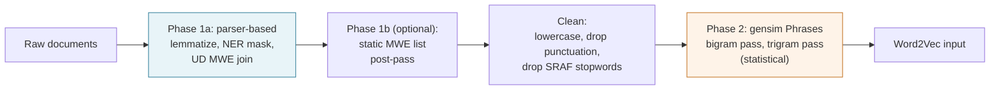

# Two-phase preprocessing

`lmsy_w2v_rfs` constructs multi-word expressions (MWEs) in two phases before Word2Vec sees a single token. Each phase catches a different class of MWE, and dropping either one measurably degrades the trained vocabulary.

---

## The flow

---

## Phase 1a: parser-based, syntactic

The configured parser tokenizes, lemmatizes, tags named entities, and joins tokens linked by Universal Dependencies v2 labels `fixed`, `flat`, `compound`, and `compound:prt`. Five backends are available through `Config.preprocessor`:

| value | Needs | Strength |
|---|---|---|
| `"corenlp"` (default) | `[corenlp]` extra and Java 8+ | Paper-exact; 76% syntactic MWE recall; best JVM thread scaling |
| `"spacy"` | `[spacy]` extra and a model | Fastest parser; best NER; 0% `fixed` or `compound:prt` recall |
| `"stanza"` | `[stanza]` extra | Python-native; 57% syntactic MWE recall; slowest on CPU |
| `"static"` | `nltk` only | Deterministic curated-list pass; no parser |
| `"none"` | nothing | Whitespace tokenize only |

Lemmatization is not optional for the 2021 seed-matching logic: the seed `integrity` needs to match surface forms `integrities` and `integrated`, which only a lemmatizer resolves. NER masking replaces proper nouns with `[NER:TYPE]` placeholders so firm names like `Apple` cannot be promoted into a culture dictionary. `preprocessor="none"` skips both and should only be used when the input is already lemmatized.

## Phase 1b: optional static MWE list

After the main preprocessor runs, a curated MWE list (`Config.mwe_list`) can join anything the parser missed. The packaged `"finance"` list is a hand-curated 200-entry file mixing UD `fixed` prepositional phrases, earnings-call jargon, and the RFS 2021 dictionary appendix. It is an example, not a default.

## Phase 2: statistical, gensim Phrases

After cleaning, gensim's `Phrases` runs one bigram pass and (by default) one trigram pass on the corpus itself. It learns high-frequency co-occurrences that no parser will flag, because they are collocations rather than grammatical units.

---

## What each phase catches

The two phases are complementary because they rely on different signals:

| MWE | Caught by | Why |
|---|---|---|
| `customer_commitment` | Phase 1a | UD `compound` between two nouns |
| `with_respect_to` | Phase 1a | UD `fixed` prepositional phrase |
| `roll_out` | Phase 1a | UD `compound:prt` phrasal verb |
| `forward_looking_statement` | Phase 2 | High-frequency collocation, no UD label |
| `fourth_quarter` | Phase 2 | Domain collocation, no UD label |

Phase 1a is grammar-driven and catches syntactic patterns that appear once or twice in the corpus. Phase 2 is frequency-driven and catches idiomatic phrasings that occur often enough to dominate their constituent words' co-occurrence statistics. Both run by default, and the full benchmark behind this design lives in [MWE benchmark comparison](../explanation/mwe-comparison.md).
