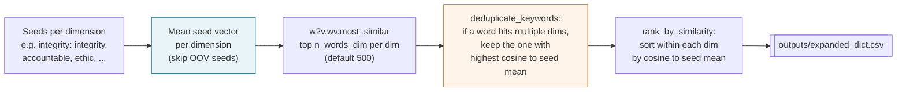

# Word2Vec dictionary

The 2021 paper's central trick: a small seed dictionary gets expanded into a much larger culture dictionary by querying the trained Word2Vec model for near neighbors. The output is a rank-sorted list of words per concept, written to `outputs/expanded_dict.csv` under `work_dir`.

---

## The flow



---

## One dimension, step by step

Take the packaged `integrity` seeds: `integrity`, `accountable`, `ethic`, `ethical`, `ethics`, `honesty`, `honorable`, `honor`, `integrities`, and a handful more (10 total). After Word2Vec training:

1. **Average the vectors.** Look up each seed in `w2v.wv.key_to_index`. Seeds missing from the vocabulary are silently skipped. The remaining vectors are averaged into a 300-dimensional "integrity prototype."
2. **Query near neighbors.** Call `w2v.wv.most_similar(positive=[mean_vec], topn=n_words_dim)` with `n_words_dim=500` by default. The result is a list of `(word, cosine)` pairs. `Config.dict_restrict_vocab` can cap the search to the top fraction of the vocabulary by frequency; `Config.min_similarity` trims the tail below a cosine threshold.
3. **Strip NER placeholders.** Any `[ner:*]` token that leaked through is filtered before the dictionary is written.

Do the same for `teamwork`, `innovation`, `respect`, and `quality`, and you have five candidate lists of up to 500 words each.

## Cross-dimension deduplication

A word like `dedication` is close to both `integrity` and `quality` in vector space. Assigning it to both dimensions would double-count it in downstream scoring. `deduplicate_keywords` resolves the conflict by comparing the word's cosine to each dimension's seed-mean vector and assigning it to the one it is closest to. Ties are broken deterministically by dimension order.

## Ranking and writing

Once each word has a single home dimension, `rank_by_similarity` sorts the members of each dimension by cosine to that dimension's seed mean, descending. Seeds themselves sit at rank 0 (the seed vector is in the seed mean). The ranked lists are written to `expanded_dict.csv` with one column per dimension.

---

## A concrete example from the paper's seeds

For a Word2Vec trained on earnings-call transcripts with the default 47 seeds, a typical `integrity` expansion looks like:

```
integrity, accountable, ethical, transparent, accountability,
responsible, fiduciary, stewardship, trust, candid, ...
```

And the full expansion also yields phrase-tokens from the two preprocessing phases, such as `customer_experience`, `skill_set`, `win_win`, `cost_effective`, and `strong_relationship`, each slotted into whichever dimension's seed mean they are closest to. This is what makes the framework useful as a research artifact: the dictionary is corpus-specific, not hand-written, but anchored to seeds the researcher supplies.

The rank from this stage becomes the similarity weight in the scoring step; see [scoring](scoring.md).
